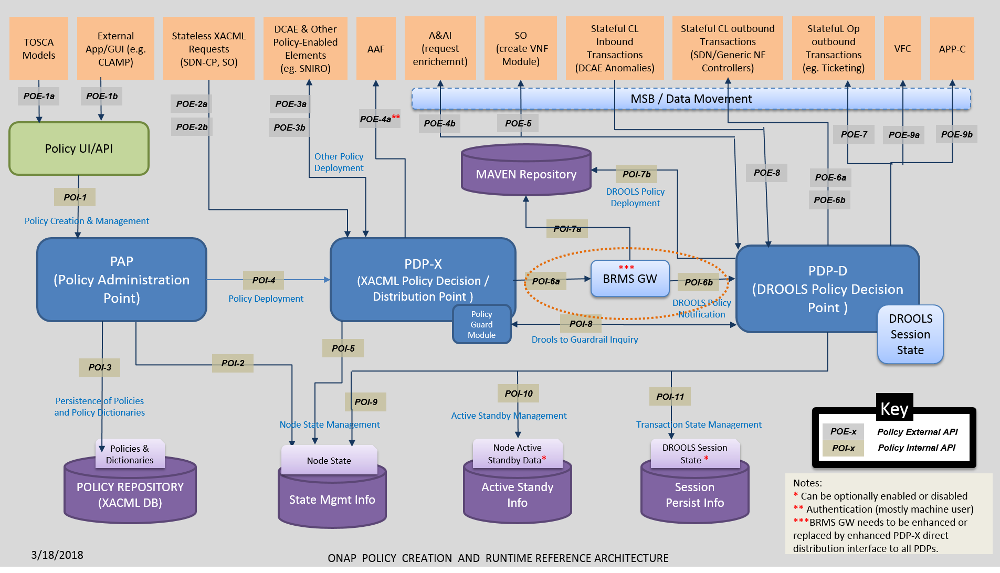
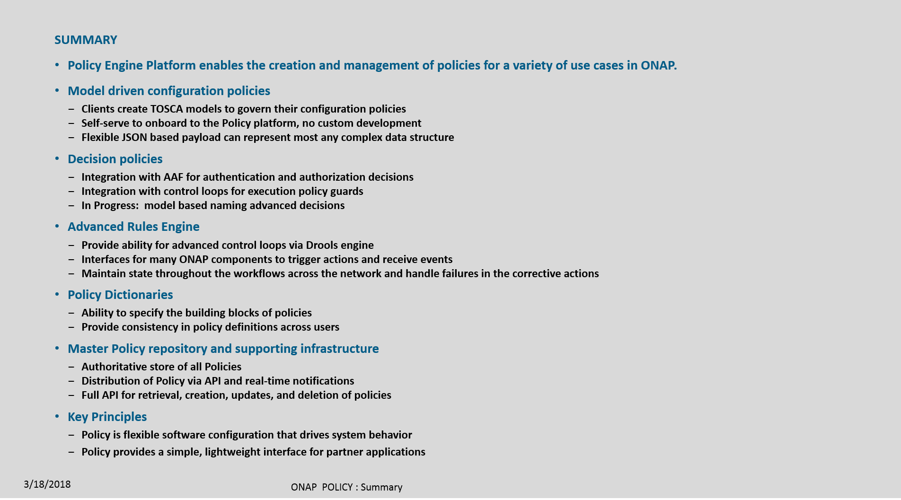

.. This work is licensed under a
.. Creative Commons Attribution 4.0 International License.
.. http://creativecommons.org/licenses/by/4.0
.. _architecture:

Architecture
------------

.. contents::
    :depth: 3

POLICY is a subsystem of ONAP that maintains, distributes, and operates on the
set of rules that underlie ONAP's control, orchestration, and management
functions.

POLICY provides a logically centralized environment for the creation and
management of policies, including conditional rules.  This provides the
capability to **create** and **validate** policies/rules, **identify
overlaps**, **resolve conflicts**, and **derive** additional policies as
needed.  Policies are used to **control**, **influence**, and help **ensure
compliance** with goals.  Policies can support infrastructure, products and
services, operation automation, and security.  Users, including network and
service designers, operations engineers, and security experts, can easily
**create**, **change**, and **manage** policy rules from the POLICY Manager
in the ONAP Portal.

The figure below represents the target POLICY Architecture.

The figure below represents the current POLICY Architecture.

A policy is defined to create a condition, requirement, constraint, decision,
or a need that must be provided, evaluated, maintained, and/or enforced.  The
policy is validated and corrected for any conflicts, and then placed in the
appropriate repository, and made available for use by other subsystems and
components.  Alternately, some policies are directly distributed to policy
decision engines such as Drools or XACML.   In this manner, the constraints,
decisions and actions to be taken are distributed.

System Architecture
^^^^^^^^^^^^^^^^^^^

ONAP POLICY is composed of several subcomponents: the **Policy Administration
Point (PAP)**, which offers interfaces for policy creation, and two types of
**Policy Decision Point (PDP)**, each based on a specific rules technology.
PDP-X is based on XACML technology and PDP-D is based on Drools technology.
PDP-X is **stateless** and can be deployed as a resource pool of PDP-X servers.
The number of servers can be grown to increase both capacity (horizontal
scalability) and to increase availability. The PDP-D is **stateful**, as it
utilizes Drools in its native, stateful way and transactions persist so long as
the PDP-D is active. Persistent Drools sessions, state management, local and
geo-redundancy have been deactivated for the initial release of ONAP POLICY
and can be turned on in a future release. Additional instances of XACML/Drools
engines and assigned roles/purposes may also be added in the future to
provide a flexible, expandable policy capability.

As illustrated in the Figure below, the POLICY components are supported by a
number of interfaces and subsystems. The ONAP Portal provides a human
interface for the creation, management and deployment of policies.  It is a
web-based system that utilizes internal APIs in the PAP.

The PAP provides interfaces for the management of policies.  It utilizes the
XACML database to store policies, which are then distributed to the PDPs.

The XACML and Drools databases are hosted in a MariaDB cluster. The XACML
database is used to persist policies and policy dictionaries and provide a
point for PDPs to retrieve policies.  The XACML database also has tables used
for node state management, detection of node failure and failover. As indicated
above, the state management tables will only include entries for the PAP and
PDP-X as the testing is not yet complete for the PDP-D.

The PDP-X receives deployed policies and has interfaces to handle XACML policy
transactions. These transactions are stateless and once complete, they are
removed from memory.  If a policy that is deployed to the PDP-X is of an
operational nature it will contain Drools rules and Java executables. These
artifacts are processed into Maven artifacts and pushed to the Maven
repository. The PDP-D is then notified a new policy has been deployed.

When the PDP-D is notified a new policy has been deployed, it downloads it from
the Maven repository and assigns it to an internal controller.  This controller
provides the external Closed Loop interfaces to the DMaaP message bus over
which events and messages are exchanged with external systems.  As events or
messages arrive at the PDP-D, they are assigned to the appropriate controller
and a Drools session is either created or retrieved from memory.  The events,
messages or facts are passed to the Drools session and the corresponding rule
is fired, resulting in a change of internal session state and possibly actions
taken in response to the rule processing. Response messages and requests are
passed by the controller back over the DMaaP message bus to the appropriate
system. The Drools session can also have timers and autonomous events. In a
future release the PDP-D can enable the node state management and session
persistence in the Drools DB.

Casablanca Additions to Architecture
^^^^^^^^^^^^^^^^^^^^^^^^^^^^^^^^^^^^
The Casablanca Release introduced two new applications into the Architecture:
The Policy SDC Distribution Application and the Apex PDP Engine. These are not
depicted in the picture above.

The Policy SDC Service Distribution application connects to SDC Service
Distribution notification flow to automatically create policies. It is
integrated with the current API. For more details on this applications
documentation, please see :ref:`apex-doc` for more information.

The Apex PDP Engine was ingested into the platform. This integration was as is
and did not formalize the Apex engine into the current policy API creation and
distribution flows. For more details on the Apex PDP Engine, please see
:ref:`policy-ssd-doc` for more information.

Further integration of these components is planned for Dublin release.

Policy Creation
^^^^^^^^^^^^^^^
The Policy Creation component of the Policy subsystem enables creation of new
policies and modification of existing polices, both during the design phase
and during runtime.  Policy Creation is targeted to be integrated to a unified
Service Design and Creation (SDC) environment.

A policy can be defined at a high level to create a condition, requirement,
constraint, decision or a need that must be provided, evaluated, maintained,
and/or enforced. A policy can also be defined at a lower or functional level,
such as a machine-readable rule or software condition/assertion which enables
actions to be taken based on a trigger or request, specific to particular
selected conditions in effect at that time.

Some examples of types of policies are:

* VNF placement - rules governing where VNFs should be placed, including
  affinity rules
* Data and feed management - what data to collect and when, retention periods,
  and when to send alarms about issues
* Access control - who (or what) can have access to which data
* Trigger conditions and actions - what conditions are actionable, and what to
  do under those conditions
* Interactions - how interactions between change management and
  fault/performance management are handled (for example, should closed loops be
  disabled during maintenance?)

Policy Distribution To PDPs
^^^^^^^^^^^^^^^^^^^^^^^^^^^

After a policy has been initially created or an existing policy has been
modified, the Policy Distribution Framework sends the policy from the
repository to its points of use, which include Policy Decision Points (PDPs)
and Policy enforcement points (DCAE, Controllers, etc), before the policy is
actually needed.

The decisions and actions taken by the policy are distributed.  Policies are
distributed either in conjunction with installation packages (for example,
related to service instantiation) or independently, if unrelated to a
particular service.  Some policies can be configured (e.g., configuring policy
parameters within microservices), while other polices are delivered to policy
engines such as XAMCL and Drools.  With this methodology, policies will already
be available when needed by a component, minimizing real-time requests to a
central policy engine or PDP (Policy Decision Point). This improves scalability
and reduces latency.

Separate notifications or events communicate the link or URL for a policy to
the components that need it.  Then, when a component needs the policy, it uses
the link to fetch it. Components in some cases might also publish events
indicating that they need new policies, eliciting a response with updated links
or URLs. Also, in some cases, policies can indicate to components that they
should subscribe to one or more policies, so that they receive automatic
updates to those policies as they become available.

Policy Decision and Enforcement
^^^^^^^^^^^^^^^^^^^^^^^^^^^^^^^

Run-time policy enforcement is performed by ONAP subsystems that are
policy-enabled or can respond to commands from a policy-enabled element such as
a PDP. For example, policy rules for data collection are enforced by the data
collection functionality of DCAE. Analytic policy rules, identification of
anomalous or abnormal conditions, and publication of events signaling detection
of such conditions are enforced by DCAE analytic applications. Policy rules for
associated remedial actions, or for further diagnostics, are enforced by the
correct component in a control loop such as the MSO, a Controller, or DCAE.
Policy engines such as XACML and Drools also enforce policies and can trigger
other components as a result (for example, causing a controller to take
specific actions specified by the policy).  Additionally, some policies
("Guard Policies") may enforce checks against decided actions.

Policy Unification and Organization
^^^^^^^^^^^^^^^^^^^^^^^^^^^^^^^^^^^
Because the POLICY framework is expandable and multipurpose, it is likely to
contain many types of policies which require organization according to some
useful dimensions.  Users can define attributes that specify the scope of
policies, and these attributes can be extended to the policy-enabled functions
and components. Useful policy organizing dimensions might include:

* Policy type or category (taxonomical)
* Policy life cycle
* Policy ownership or administrative domain
* Geographic area or location,
* Technology type
* Policy language and version
* Security level or other security-related values, specifiers, or limiters

Attributes can be specified for each dimension. In addition to being defined
for individual policies themselves, these attributes can be used to define the
scope of these additional additional policy-related functions:

* Policy events or requests/triggers
* Policy decision, enforcement, or other functions
* Virtual functions of any type

Policy writers can define attributes so that policy events or requests
self-indicate their scope. The scope is then examined by a suitable function
and subsequently acted upon accordingly. Policy decisions and enforcement
functions can self-indicate their scope of decision-making, enforcement, or
other capabilities. Virtual functions can be automatically attached to the
appropriate POLICY Framework and distribution mechanisms.

End of Document

