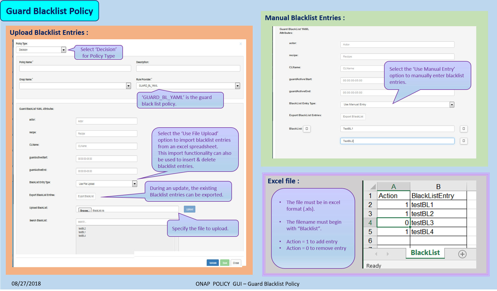

.. This work is licensed under a Creative Commons Attribution 4.0 International License.
.. http://creativecommons.org/licenses/by/4.0

*********************************
Creating and Using Guard Policies
*********************************

.. contents::
    :depth: 3

Background
^^^^^^^^^^

Guard policies are used to limit what operations shall be permitted. These policies are specified in the Policy GUI or restful API and either return "PERMIT" or "DENY" on request.

There are 2 types of policies, guard policies and blacklist guard policies. The blacklist describes what is not allowed to be permitted and guard policies describe what is allowed to be permitted.  The Policy PDP behaves in a PERMIT overrides fashion, that is,  if any policy permits, it will override any denies.

.. note:: *Limit Functionality*: The determination to deny a request because it has exceeded the limit is based on the number of entries in the **database**.  

Creating Guard Policies
^^^^^^^^^^^^^^^^^^^^^^^

There are two options for creating guard policies: (1) through the GUI and (2) through the restful API.

GUI Method
----------

The GUARD policy can be created from the POLICY GUI as shown below.

In a Blacklist policy, the blacklist entries can be entered either manually or imported from an excel sheet.  This import option can also be used to delete existing blacklist entries and to add new entries.

API Method
----------

To create the policy, use the PUT /createPolicy API. This request uses Basic Access Authentication. 

The request should be in the following form for the regular guard policy:

.. code-block:: json
   :caption: Regular Guard Policy Creation
   :linenos:

    {
        "policyClass": "Decision",
        "policyName": "Test.TestingGUARDapitest",
        "policyDescription": "Testing new YAML Guard Policy",
        "onapName": "PDPD",
        "ruleProvider": "GUARD_YAML",
        "attributes": {
            "MATCHING": {
                "actor": "APPC",
                "recipe": "restart",
                "targets" : "test",
                "clname" : "test",
                "limit": "5",
                "timeWindow": "15",
                "timeUnits" : "minute",
                "guardActiveStart": "05:00:00-05:00",
                "guardActiveEnd": "23:59:59-05:00"
            }
        }
    }

The request should be in the following form for blacklist guard policy:

.. code-block:: json
   :caption: Blacklist Guard Policy Creation
   :linenos:

    {
        "policyClass": "Decision",
        "policyName": "Test.TestingBLGUARD",
        "policyDescription": "Testing New BL YAML Guard Policy",
        "onapName": "MSO",
        "ruleProvider": "GUARD_BL_YAML",
        "attributes": {
            "MATCHING": {
                "actor": "APPC",
                "recipe": "restart",
                "clname": "test",
                "guardActiveStart": "05:00:00-05:00",
                "guardActiveEnd": "23:59:59-05:00",
                "blackList": "target1,target2,target3"
            }
        }
    }

Using Guard Policies
^^^^^^^^^^^^^^^^^^^^

In order to use the guard policies just make an http request. For example:

.. code-block:: bash

    http
     POST pdp:8081/pdp/api/getDecision
     Authorization:<yourAuth> ClientAuth:<yourClientAuth>
     Environment:<environment> Content-Type:application/json < guard_request.json
    
| where:
|     *<yourAuth>*       is the string generated from user:pass converted to base64 encoding.
|     *<yourClientAuth>* is generated the same way but from the client user and pass.
|     *<environment>*    is the context of the request. For example: TEST

The guard_request.json should be in the form of the following:

.. code-block:: json
   :caption: guard_request.json

    {
      "decisionAttributes": {
            "actor": "APPC",
            "recipe": "Restart",
            "target": "test13",
            "clname" : "piptest"
        },
      "onapName": "PDPD"
    }

A response containing a “PERMIT” or “DENY” in uppercase is returned as follows:

.. code-block:: json
   :caption: Response

    {
      "decision": "PERMIT",
      "details": "Decision Permit. OK!"
    }

End of Document

.. SSNote: Wiki page ref.  https://wiki.onap.org/display/DW/Creating+and+Using+Guard+Policies

