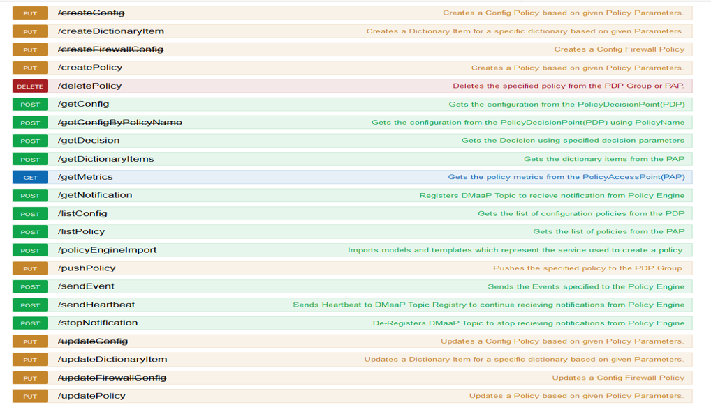

.. This work is licensed under a Creative Commons Attribution 4.0 International License.
.. http://creativecommons.org/licenses/by/4.0

Offered APIs
============

.. contents:: 
    :depth: 2

The Policy subsystem of ONAP maintains, distributes, and operates on the set of rules that underlie ONAP’s control, orchestration, and management functions. Policy provides a centralized environment for the creation and management of easily-updatable conditional rules. It enables users to validate policies and rules, identify and resolve overlaps and conflicts, and derive additional policies where needed.  The following operations are supported by the policy API:

* Create policies on the PAP 
* Update policies on the PAP
* Delete policies on the PAP or PDP
* Push policies from the PAP to the PDP
* List policies on the PDP
* Get config data of policies on the PDP
* Create Dictionary Items
* Update Dictionary Items
* Retrieve Dictionary Items
* Import Micro Services Models
* Retrieve Metrics for policy counts from PDP and PAP

POLICY Engine Services
^^^^^^^^^^^^^^^^^^^^^^

POLICY API Details
^^^^^^^^^^^^^^^^^^

.. swaggerv2doc:: api-docs.json

Examples
^^^^^^^^

**SAMPLE JAVA CLIENT CODE**

    .. code-block:: java
       :caption: Get Config Example
       :linenos:

        package org.onap.policyEngine;
          
        import java.util.Collection;
          
        import org.onap.policy.api.ConfigRequestParameters;
        import org.onap.policy.api.PolicyConfig;
        import org.onap.policy.api.PolicyEngine;
          
        public class GetConfigSample {
          
            public static void main(String[] args) throws Exception {
                PolicyEngine pe = new PolicyEngine("config.properties");
                ConfigRequestParameters configRequestParams = new ConfigRequestParameters();
                configRequestParams.setPolicyName(".*");
                Collection<PolicyConfig> configs = pe.getConfig(configRequestParams);
                for (PolicyConfig config: configs){
                    System.out.println(config.getPolicyConfigMessage());
                    System.out.println(config.getPolicyConfigStatus());
                }
            }
        }

    .. code-block:: java
       :caption: Create Config FIrewall Policy Example
       :linenos:

        package org.onap.policyEngine;
          
        import java.io.File;
        import java.io.FileInputStream;
        import java.io.FileNotFoundException;
        import java.io.IOException;
        import java.io.InputStream;
        import java.io.StringReader;
        import java.nio.file.Path;
        import java.nio.file.Paths;
        import java.text.SimpleDateFormat;
        import java.util.Date;
        import java.util.UUID;
          
        import javax.json.Json;
        import javax.json.JsonObject;
        import javax.json.JsonReader;
          
        import org.onap.policy.api.PolicyChangeResponse;
        import org.onap.policy.api.PolicyConfigType;
        import org.onap.policy.api.PolicyEngine;
        import org.onap.policy.api.PolicyParameters;
        import org.onap.policy.api.PolicyType;
          
        public class ConfigFirewallPolicyClient {
            static Boolean isEdit = false;
            public static void main(String[] args) {
                try{    
                    PolicyEngine policyEngine = new PolicyEngine("config.properties");
                    PolicyParameters policyParameters = new PolicyParameters();
                    // Set Policy Type
                    policyParameters.setPolicyConfigType(PolicyConfigType.Firewall); //required
                    policyParameters.setPolicyName("MikeAPItesting.testConfigFirewallPolicy1607_1"); //required
                    //policyParameters.setPolicyScope("MikeAPItesting");
                    //Directory will be created where the Policies are saved... this displays a subscope on the GUI
                    policyParameters.setRequestID(UUID.randomUUID());
                      
                    // Set Safe Policy value for Risk Type
                    SimpleDateFormat dateformat3 = new SimpleDateFormat("dd/MM/yyyy");
                    Date date = dateformat3.parse("15/10/2016");
                    policyParameters.setTtlDate(date);
                    // Set Safe Policy value for Guard
                    policyParameters.setGuard(true);
                    // Set Safe Policy value for Risk Level
                    policyParameters.setRiskLevel("5");
                    // Set Safe Policy value for Risk Type
                    policyParameters.setRiskType("PROD");
                    File jsonFile = null;
                    String jsonRuleList = null;
                    Path file = Paths.get("C:\\policyAPI\\firewallRulesJSON\\Config_FW_Sample.json");
                    jsonFile = file.toFile();
                      
                    //buildJSON(jsonFile, jsonRuleList);
                    policyParameters.setConfigBody(buildJSON(jsonFile, jsonRuleList).toString());       
                    policyParameters.setConfigBodyType(PolicyType.JSON);
                    // API method to create Policy or update policy
                    PolicyChangeResponse response = null;
                    if (!isEdit) {
                        response = policyEngine.createPolicy(policyParameters);
                    } else {
                        response = policyEngine.updatePolicy(policyParameters);
                    }
                      
                    if(response.getResponseCode()==200){
                        System.out.println(response.getResponseMessage());
                        System.out.println("Policy Created Successfully!");
                    }else{
                        System.out.println("Error! " + response.getResponseMessage());
                    }
                } catch (Exception e) {
                    System.err.println(e.getMessage());
                }
                  
        }
              
            private static JsonObject buildJSON(File jsonInput, String jsonString) throws FileNotFoundException {
                JsonObject json = null;
                JsonReader jsonReader = null;
                if (jsonString != null && jsonInput == null) {
                    StringReader in = null;
                    in = new StringReader(jsonString);
                    jsonReader = Json.createReader(in);
                    json = jsonReader.readObject();
                    in.close();
                } else {
                    InputStream in = null;
                    in = new FileInputStream(jsonInput); 
                    jsonReader = Json.createReader(in);
                    json = jsonReader.readObject();
                    try {
                        in.close();
                    } catch (IOException e) {
                        System.err.println("Exception Occured while closing input stream"+e);
                    }
                }
                jsonReader.close();
                return json;
            }
          
        }

    .. code-block:: java
       :caption: Sample JSON file - Config_FW_Sample.json
       :linenos:

        {
              "serviceTypeId": "/v0/firewall/pan",
              "configName": "AFTTFwPolicy1Config",
              "deploymentOption": {
                    "deployNow": false
              },
              "securityZoneId": "cloudsite:dev1a",
              "serviceGroups": [{
                    "name": "SSH",
                    "description": "Ssh service entry in service list",
                    "type": "SERVICE",
                    "transportProtocol": "tcp",
                    "appProtocol": null,
                    "ports": "22"
              }],
              "addressGroups": [{
                    "name": "CiscoVCE",
                    "description": "Destination CiscoCVE",
                    "members": [{
                          "type": "SUBNET",
                          "value": "12.63.31.61/12"
                    }]
              }, {
                    "name": "HOHOServers",
                    "description": "Source HOHOServers for first testing",
                    "members": [{
                          "type": "SUBNET",
                          "value": "12.60.32.11/23"
                    }]
              }],
              "firewallRuleList": [{
                    "position": "1",
                    "ruleName": "FWRuleHOHOServerToCiscoVCE",
                    "fromZones": ["UntrustedZoneCiscoCVEName"],
                    "toZones": ["TrustedZoneHOHOName"],
                    "negateSource": false,
                    "negateDestination": false,
                    "sourceList": [{
                          "type": "REFERENCE",
                          "name": "HOHOServers"
                    }],
                    "destinationList": [{
                          "type": "REFERENCE",
                          "name": "CiscoVCE"
                    }],
                    "sourceServices": [],
                    "destServices": [{
                          "type": "REFERENCE",
                          "name": "SSH"
                    }],
                    "action": "accept",
                    "description": "FW rule for HOHO source to CiscoVCE destination",
                    "enabled": true,
                    "log": true
              }]
        }

    .. code-block:: java
       :caption: Delete Policy Example
       :linenos:

        package org.onap.policyEngine;
          
        import org.onap.policy.api.DeletePolicyCondition;
        import org.onap.policy.api.DeletePolicyParameters;
        import org.onap.policy.api.PolicyChangeResponse;
        import org.onap.policy.api.PolicyEngine;
          
        public class DeletePolicyClient {
          
            public static void main(String[] args) {
                try {
          
                    PolicyEngine policyEngine = new PolicyEngine("config.properties");
                    DeletePolicyParameters policyParameters = new DeletePolicyParameters();         
                                  
                    //Parameter arguments
                    policyParameters.setPolicyName("MikeConsole.Config_testDeleteAPI6.1.xml");
                    policyParameters.setPolicyComponent("PDP");
                    policyParameters.setPdpGroup("default");
                    policyParameters.setDeleteCondition(DeletePolicyCondition.ALL);
                    policyParameters.setRequestID(null);
                      
                    // API method to Push Policy to PDP
                    PolicyChangeResponse response = null;
                    response = policyEngine.deletePolicy(policyParameters);
          
                    if(response.getResponseCode()==200){
                        System.out.println(response.getResponseMessage());
                        System.out.println("Policy Deleted Successfully!");
                    }else{
                        System.out.println("Error! " + response.getResponseMessage());
                    }
          
                } catch (Exception e) {
                    System.err.println(e.getMessage());     
                      
                }
            }
        }

    .. code-block:: java
       :caption: Push Policy Example
       :linenos:

        package org.onap.policyEngine;
          
        import org.onap.policy.api.PolicyChangeResponse;
        import org.onap.policy.api.PolicyEngine;
        import org.onap.policy.api.PushPolicyParameters;
          
        public class PushPoliciesToPDP {
            public static void main(String[] args) {
                try {
          
                    PolicyEngine policyEngine = new PolicyEngine("config.properties");
                    PushPolicyParameters policyParameters = new PushPolicyParameters();         
                                  
                    //Parameter arguments
                    policyParameters.setPolicyName("Mike.testCase1");
                    policyParameters.setPolicyType("Base");
                    //policyParameters.setPolicyScope("MikeAPItesting");
                    policyParameters.setPdpGroup("default");            
                    policyParameters.setRequestID(null);
                      
                    // API method to Push Policy to PDP
                    PolicyChangeResponse response = null;
                    response = policyEngine.pushPolicy(policyParameters);
          
                    if(response.getResponseCode()==204){
                        System.out.println(response.getResponseMessage());
                        System.out.println("Policy Pushed Successfully!");
                    }else{
                        System.out.println("Error! " + response.getResponseMessage());
                    }
          
                } catch (Exception e) {
                    System.err.println(e.getMessage());     
                      
                }
            }
        }

    .. code-block:: java
       :caption: Decision Policy Example
       :linenos:

        package org.onap.policyEngine;
          
        import java.util.Arrays;
        import java.util.HashMap;
        import java.util.LinkedList;
        import java.util.List;
        import java.util.Map;
        import java.util.UUID;
          
        import org.onap.policy.api.AttributeType;
        import org.onap.policy.api.PolicyChangeResponse;
        import org.onap.policy.api.PolicyClass;
        import org.onap.policy.api.PolicyEngine;
        import org.onap.policy.api.PolicyParameters;
          
        public class DecisionPolicyClient {
            static Boolean isEdit = true;
            public static void main(String[] args) {
                try {
                    PolicyEngine policyEngine = new PolicyEngine("config.properties");
                    PolicyParameters policyParameters = new PolicyParameters();
                    // Set Policy Type
                    policyParameters.setPolicyClass(PolicyClass.Decision); //required
                    policyParameters.setPolicyName("MikeAPItests.testDecisionAPI"); //required
                    policyParameters.setOnapName("java"); //required
                    policyParameters.setPolicyDescription("This is a sample Decision policy UPDATE example with Settings");  //optional
                    //policyParameters.setPolicyScope("MikeAPItests");
         //Directory will be created where the Policies are saved... this 
        displays a a subscope on the GUI
                      
                    //Set the Component Attributes... These are Optional
                    Map<String, String> configAttributes = new HashMap<>(); 
                    configAttributes.put("Template", "UpdateTemplate");
                    configAttributes.put("controller", "default"); 
                    configAttributes.put("SamPoll", "30");
                    configAttributes.put("value", "abcd"); 
                      
                    Map<AttributeType, Map<String,String>> attributes = new HashMap<>();
                    attributes.put(AttributeType.MATCHING, configAttributes);
                      
                    //Set the settings... These are Optional
                    Map<String, String> settingsMap = new HashMap<>();
                    settingsMap.put("server", "5");
                      
                    attributes.put(AttributeType.SETTINGS, settingsMap);
                    policyParameters.setAttributes(attributes);
          
                      
                    List<String> dynamicRuleAlgorithmLabels = new LinkedList<>();
                    List<String> dynamicRuleAlgorithmFunctions = new LinkedList<>();
                    List<String> dynamicRuleAlgorithmField1 = new LinkedList<>();
                    List<String> dynamicRuleAlgorithmField2 = new LinkedList<>();
                      
                    //Example of a complex Rule algorithm using the settings in the Field1
                    /* label    field1      function                field2
                     * *****************************************************
                     * A1       S_server    integer-equal               90
                     * A2       cap         string-contains             ca
                     * A3       cobal       integer-equal               90  
                     * A4       A2          and                         A3
                     * A5       Config      integer-greater-than        45
                     * A6       A4  `       or                          A5
                     * A7       A1          and                         A6
                     */
                    dynamicRuleAlgorithmLabels = Arrays.asList("A1","A2","A3","A4","A5","A6","A7");
                    dynamicRuleAlgorithmField1 = Arrays.asList("S_server","cap","cobal","A2","Config","A4","A1");
                    dynamicRuleAlgorithmFunctions = Arrays.asList("integer-equal","string-contains","integer-equal","and","integer-greater-than","or","and");
                    dynamicRuleAlgorithmField2 = Arrays.asList("90","ca","90","A3","45","A5","A6");
                              
                    policyParameters.setDynamicRuleAlgorithmLabels(dynamicRuleAlgorithmLabels);
                    policyParameters.setDynamicRuleAlgorithmField1(dynamicRuleAlgorithmField1);
                    policyParameters.setDynamicRuleAlgorithmFunctions(dynamicRuleAlgorithmFunctions);
                    policyParameters.setDynamicRuleAlgorithmField2(dynamicRuleAlgorithmField2);
                      
                    policyParameters.setRequestID(UUID.randomUUID());
                      
                    // API method to create Policy or update policy
                    PolicyChangeResponse response = null;
                    if (!isEdit) {
                        response = policyEngine.createPolicy(policyParameters);
                    } else {
                        response = policyEngine.updatePolicy(policyParameters);
                    }
                      
                    if(response.getResponseCode()==200){
                        System.out.println(response.getResponseMessage());
                        System.out.println("Policy Created Successfully!");
                    }else{
                        System.out.println("Error! " + response.getResponseMessage());
                    }
                } catch (Exception e) {
                    System.err.println(e.getMessage());
                }
            }
        }

    .. code-block:: java
       :caption: List Config Policy Example
       :linenos:

        package org.onap.policyEngine;
          
        import java.util.Collection;
        import java.util.HashMap;
        import java.util.Map;
        import java.util.UUID;
          
        import org.onap.policy.api.ConfigRequestParameters;
        import org.onap.policy.api.PolicyConfigException;
        import org.onap.policy.api.PolicyEngine;
        import org.onap.policy.api.PolicyEngineException;
        import org.onap.policy.common.logging.flexlogger.FlexLogger;
        import org.onap.policy.common.logging.flexlogger.Logger;
          
        public class ListConfigPoliciesClient {
              
            private static final Logger LOGGER  = FlexLogger.getLogger(ListConfigPoliciesClient.class);
              
            public static void main(String[] args) {
                PolicyEngine policyEngine;
          
                // List Config Policies Example 
                try {
                    policyEngine = new PolicyEngine("config.properties");
                    ConfigRequestParameters parameters = new ConfigRequestParameters();
                      
                    parameters.setPolicyName(".*");
                    parameters.setOnapName(".*");
                    parameters.setConfigName(".*");
                      
                    Map<String, String> configAttributes = new HashMap<>();
                    configAttributes.put("java", "java");
                    configAttributes.put("peach", "Tar");
                    configAttributes.put("true", "false");
                    configAttributes.put("small", "testPass");
                    parameters.setConfigAttributes(configAttributes);
                      
                    parameters.setRequestID(UUID.randomUUID());
                      
                    Collection<String> response = policyEngine.listConfig(parameters);
                    if(response!=null && !response.contains("PE300")){
                        for(String configList : response){
                            System.out.println(configList.toString()+"\n");
                        }
                    }else{
                        System.out.println("Error! " +response);
                    }
          
                } catch (PolicyConfigException e) {
                    LOGGER.error("Exception Occured"+e);
                } catch (PolicyEngineException e) {
                    LOGGER.error("Exception Occured"+e);
                }
            }
        }

**JSON EXAMPLES**

    .. code-block:: java
       :caption: Create Microservice Policy
       :linenos:

        API: createPolicy  
        OPERATION: PUT
        REQUEST BODY:
        {
            "configBody": "{
                    \"service\":\"ControllerServiceSampleSdnlServiceInstance\",
                    \"location\":\"Edge\",
                    \"uuid\":\"TestUUID\",
                    \"policyName\":\"testRestCreateMicroServicesNewParams\",
                    \"description\":\"testing Create\",
                    \"configName\":\"TestName\",
                    \"templateVersion\":\"1604\",
                    \"priority\":\"4\",
                    \"version\":\"0.1.0-SNAPSHOT\",
                    \"policyScope\":\"resource=F5,service=vSCP,type=configuration,closedLoopControlName=vSCP_F5_Firewall_d925ed73-8231-4d02-9545-db4e101f88f8\",
                    \"content\":{
                            \"taskOrchestratedConfiguration\":\"test\",
                            \"taskCustomConfiguration\":\"set\",
                            \"configuration\":\"test\",
                            \"cdapUrl\":\"testurl\",
                            \"taskName\":\"test\",
                            \"taskNameTEST\":\"TEST\",
                            \"users\":\"[tuser]\",
                            \"adminUsers\":\"[lji]\",
                            \"taskConfigFilePath\":\"test\",
                            \"managerPortNumber\":\"999\",
                            \"taskType\":\"test\",
                            \"taskCommandFilePath\":\"tset\",
                            \"contailIp\":\"test\",
                            \"consoleUsers\":\"[odu-e2e]\",
                            \"taskStatusFilePath\":\"test\"
                    }
            }",
            "policyConfigType": "MicroService",
            "policyName": "MikeAPITesting.testRestCreateMicroServicesNewParams",
            "ecompName": "SDNC"
        }

    .. code-block:: java
       :caption: Update Microservice Policy
       :linenos:

        API: updatePolicy  
        OPERATION: PUT
        REQUEST BODY:
        {
            "configBody": "{
                    \"service\":\"ControllerServiceSampleSdnlServiceInstance\",
                    \"location\":\"Edge\",
                    \"uuid\":\"TestUUID\",
                    \"policyName\":\"testRestCreateMicroServicesNewParams\",
                    \"description\":\"testing Update\",
                    \"configName\":\"TestName\",
                    \"templateVersion\":\"1604\",
                    \"priority\":\"4\",
                    \"version\":\"0.1.0-SNAPSHOT\",
                    \"policyScope\":\"resource=F5,service=vSCP,type=configuration,closedLoopControlName=vSCP_F5_Firewall_d925ed73-8231-4d02-9545-db4e101f88f8\",
                    \"content\":{
                            \"taskOrchestratedConfiguration\":\"test\",
                            \"taskCustomConfiguration\":\"set\",
                            \"configuration\":\"test\",
                            \"cdapUrl\":\"testurl\",
                            \"taskName\":\"test\",
                            \"taskNameTEST\":\"TEST\",
                            \"users\":\"[tuser]\",
                            \"adminUsers\":\"[lji]\",
                            \"taskConfigFilePath\":\"test\",
                            \"managerPortNumber\":\"999\",
                            \"taskType\":\"test\",
                            \"taskCommandFilePath\":\"tset\",
                            \"contailIp\":\"test\",
                            \"consoleUsers\":\"[odu-e2e]\",
                            \"taskStatusFilePath\":\"test\"
                    }
            }",
            "policyConfigType": "MicroService",
            "policyName": "MikeAPITesting.testRestUpdateMicroServicesNewParams",
            "ecompName": "SDNC"
        }

**CURL EXAMPLES**

    .. code-block:: bash
       :caption: Push Policy

        echo "pushPolicy : PUT : com.vLoadBalancer"
        echo "pushPolicy : PUT : com.vLoadBalancer"
        curl -v --silent -X PUT --header 'Content-Type: application/json' --header 'Accept: text/plain' --header 'ClientAuth: XYZ' --header 'Authorization: Basic XYZ' --header 'Environment: TEST' -d '{
          "pdpGroup": "default",
          "policyName": "com.vLoadBalancer",
          "policyType": "MicroService"
        }' 'http://pdp:8081/pdp/api/pushPolicy'

    .. code-block:: bash
       :caption: Delete Policy

        echo "deletePolicy : DELETE : com.vFirewall"
        curl -v --silent -X DELETE --header 'Content-Type: application/json' --header 'Accept: text/plain' --header 'ClientAuth: XYZ' --header 'Authorization: Basic XYZ' --header 'Environment: TEST' -d '{
          "pdpGroup": "default",
          "policyComponent": "PDP",
          "policyName": "com.vFirewall",
          "policyType": "MicroService"
        }' 'http://pdp:8081/pdp/api/deletePolicy'

    .. code-block:: bash
       :caption: Get Config 

        echo "Get all Config Policy example"
        curl -i -v -H 'Content-Type: application/json' -H 'Accept: application/json' -H 'ClientAuth: XYZ' -H 'Authorization: Basic XYZ -H 'Environment: TEST' -X POST -d '{
        "policyName": ".*"
        }' http://${PDP_IP}:8081/pdp/api/getConfig

**ADDITIONAL EXAMPLES**

    .. code-block:: bash
       :caption: Deleting a Policy from PAP

        // Deleting from PAP will remove the policy from the PolicyEntity & PolicyVersion tables (UI-Editor tab).
        // This means that the policy is no longer be available in Policy System.
         
        // PayLoad:
        {    "policyName": "com.testpolicy",    //scope.policyName   
             "policyType": "Base",              //policy type   
             "policyComponent": "PAP",          //component name   
             "deleteCondition": "ALL"           //versions (ALL or CURRENT)
        }

    .. code-block:: bash
       :caption: Deleting a Policy from PDP

        // Deleting from PDP will delete the policy from the PDP Group.  The policy is still available in Policy System. 
        // When the policy is needed again, the policy should be pushed to the PDP.
         
        // PayLoad:
        {    "policyName": "com.testpolicy",   //scope.policyName   
             "policyType": "Base",             //policy type   
             "policyComponent": "PDP",         //component name   
             "pdpGroup": "Default"             //group name
        }

Additional Information
^^^^^^^^^^^^^^^^^^^^^^

Additional information, including examples, can be found at `PolicyApi link`_.

.. _PolicyApi link: https://wiki.onap.org/display/DW/Policy+API

End of Document

