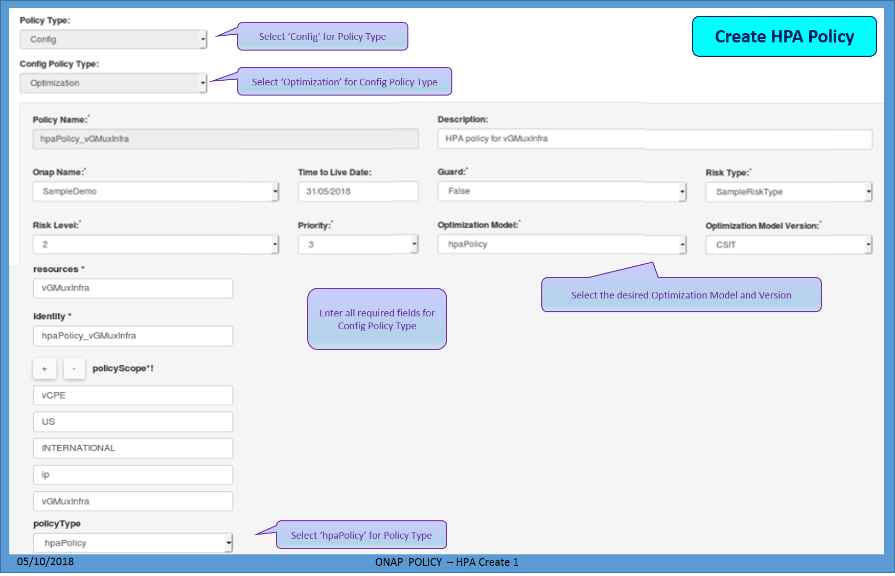

.. This work is licensed under a Creative Commons Attribution 4.0 International License.
.. http://creativecommons.org/licenses/by/4.0

**************
Policy OOF HPA 
**************

.. contents::
    :depth: 2

Background
^^^^^^^^^^

The OOF(ONAP Optimization Framework) retrieves applicable constraints and objective functions as policies from the policy platform. These policies are retrieved at runtime, thus allowing an operator to change policies as and when needed. These policies are specified using policy models that are on-boarded during the OOF application deployment-time in the policy platform. The OOF-related policy models are typically derived from the constraints and objective functions of an OOF-application. Currently, for R2, these models will be pushed into the policy platform manually using the OOF policy uploaded module. 
Below is an example using HPA (Hardware Platform Awareness). 

Updating Policy Models
^^^^^^^^^^^^^^^^^^^^^^

The following HPA TOSCA policy models need to be uploaded as a dictionary during the deployment-time of an optimization application. Currently, the model uploading process is manual since the policy system does not offer an interface to upload models programmatical. Once the models are uploaded, policy templates are created in the policy portal/GUI using which optimization policies can be created. Alternatively, the policy system offers CRUD REST APIs using which the policies can be managed by the application.

.. code-block:: bash
   :caption: HPA Policy
   :linenos:

    tosca_definitions_version: tosca_simple_yaml_1_0_0
    node_types:
        policy.nodes.hpaPolicy:
            derived_from: policy.nodes.Root
            properties:
                policyScope:
                    type: list
                    description: scope where the policy is applicable
                    required: true
                    matchable: true
                    entry_schema:
                        type: string
                policyType:
                    type: list
                    description: type of a policy
                    required: true
                    matchable: true
                    entry_schema:
                        type: string
                        consraints:
                        -   valid_values:
                            - hpaPolicy
                resource:
                    type: string
                    required: true
                identity:
                    type: string
                    required: true
                flavorFeatures:
                    type: list
                    required: true
                    entry_schema:
                    -   type: policy.data.flavorFeatures_properties
    data_types:
        policy.data.flavorFeatures_properties:
            derived_from: tosca.nodes.Root
            properties:
                flavorLabel:
                    type: string
                    required: true
                flavorProperties:
                    type: list
                    required: true
                    entry_schema:
                    -   type: policy.data.flavorProperties_properties
        policy.data.flavorProperties_properties:
            derived_from: tosca.nodes.Root
            properties:
                hpa-feature:
                    type: string
                    required: true
                mandatory:
                    type: string
                    required: true
                score:
                    type: string
                    required: true
                architecture:
                    type: string
                    required: true
                hpa-version:
                    type: string
                    required: true
                hpa-feature-attributes:
                    type: list
                    required: true
                    entry_schema:
                    -   type: policy.data.hpa-feature-attributes_properties
        policy.data.hpa-feature-attributes_properties:
            derived_from: tosca.nodes.Root
            properties:
                hpa-attribute-key:
                    type: string
                    required: true
                hpa-attribute-value:
                    type: string
                    required: true
                operator:
                    type: list
                    required: true
                    entry_schema:
                        type: string
                        constraints:
                        -   valid_values:
                            - <
                            - <=
                            - '>'
                            - '>='
                            - '='
                            - '!='
                            - any
                            - all
                            - subset
                unit:
                    type: string
                    required: true

The POLICY Dictionary tab is used to create and manage attributes in the dictionaries.

    1. Access to the POLICY GUI via the ONAP Portal. Select Dictionary on the left side.
    2. Select Policy Type Dictionary. you need choose the Optimization Policy. 
    3. Select Dictionary. you need Select ONAP Optimization Models.
    4. Click Import Dictionary's  button, upload the HPA Policy file.

The image below shows an example of an uploaded policy.

Creating HPA Policies
^^^^^^^^^^^^^^^^^^^^^

There are two options for creating policies: (1) through the GUI and (2) through the restful API.

GUI Method
----------

From the POLICY GUI:

1. Select editor, right click a scope and choose create policy
2. Choose Config under Policy Type
3. Choose Optimization under Optimization
4. Enter  all required fields I for common Config Policy Type:

 * Policy Name
 * Onap Name - Name of the source of the requests
 * Guard
 * Risk Type
 * Risk Level
 * Priority
 * Optimization Model: choose hpaPolicy
 * Optimization Model Version: CSIT

5. Enter all required fields II about specified Optimization Config Policy Type:
6. Click validate, then save

Below is an example of a policy that uses the HPA feature: hpaPolicy_vGmuxInfra. 

API Method
----------

To create the policy, use the PUT /createPolicy API.  
The request should be in the following form for the Optimization policy:

.. code-block:: json
   :caption: HPA Policy Json file
   :linenos:

    {
        "service": "hpaPolicy",
        "policyName": "hpaPolicy_vGMuxInfra",
        "description": "HPA policy for vGMuxInfra",
        "templateVersion": "0.0.1",
        "version": "1.0",
        "priority": "3",
        "riskType": "SampleRiskType",
        "riskLevel": "2",
        "guard": "False",
        "Optimization Model" : "hpaPolicy",
        "Optimization Model Version": "CSIT",
        "content": {
          "resources": "vGMuxInfra",
          "identity": "hpaPolicy_vGMuxInfra",
          "policyScope": ["vCPE", "US", "INTERNATIONAL", "ip", "vGMuxInfra"],
          "policyType": "hpaPolicy",
          "flavorFeatures": [
            {
              "flavorLabel": "flavor_label_vm_01",
              "flavorProperties":[
                {
                  "hpa-feature" : "cpuTopology",
                  "mandatory" : "True",
                  "architecture": "generic",
                  "score": 3,
                  "hpa-feature-attributes": [
                    {"hpa-attribute-key":"numCpuSockets", "hpa-attribute-value": "2","operator": ">=", "unit": ""}
                  ]
                }
              ]
            }
            ]
        }
    }

Push Policy
^^^^^^^^^^^

Use the Push tab to push the policy and make it active on the pdp-x.

	1. From the web, select Push tab
	2. Select the polices
	3. Select the PDP
	4. Click the Push Polices button

A message will be displayed indicatng a successful push. 

Semantics of  Policy attributes
^^^^^^^^^^^^^^^^^^^^^^^^^^^^^^^

.. code-block:: bash
   :caption: HPA Feature Attributes Semantics

    "hpa-feature-attributes": [
        {
          "hpa-attribute-key": "{attribute name}",
          "hpa-attribute-value": "{attribute value}",
          "operator": "{comparison operator}",
          "unit": "{the unit of an attribute}"
        }
    ]

    # An Example

    "hpa-feature-attributes": [
      {"hpa-attribute-key":"numCpuSockets", "hpa-attribute-value": "2","operator": ">=", "unit": ""},
      {"hpa-attribute-key":"numCpuSockets", "hpa-attribute-value": "4","operator": "<=", "unit": ""},
      {"hpa-attribute-key":"numCpuCores", "hpa-attribute-value": "2", "operator":">=", "unit": ""},
      {"hpa-attribute-key":"numCpuCores", "hpa-attribute-value": "4", "operator":"<=", "unit": ""},
      {"hpa-attribute-key":"numCpuThreads", "hpa-attribute-value": "4", "operator":">=", "unit": ""},
      {"hpa-attribute-key":"numCpuThreads", "hpa-attribute-value": "8", "operator":"<=", "unit": ""}
    ]

.. seealso:: `Policy Specification and Retrieval for OOF <https://wiki.onap.org/display/DW/Policy+Specification+and+Retrieval+for+OOF>`_

End of Document

.. SSNote: Wiki page ref. https://wiki.onap.org/display/DW/Policy+OOF+HPA

