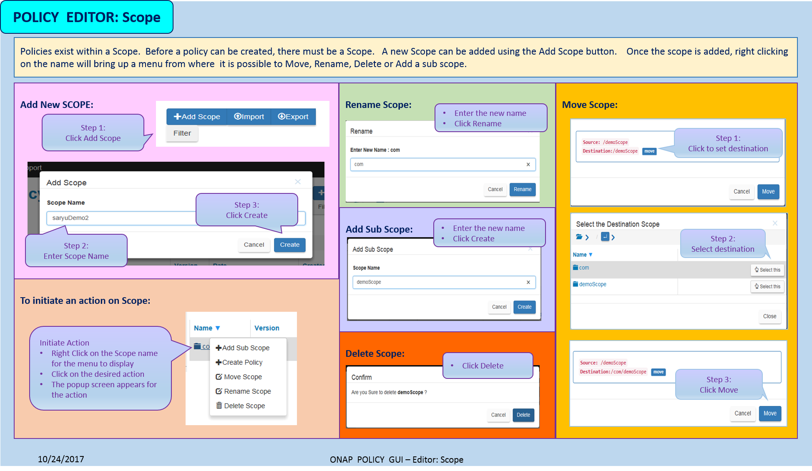
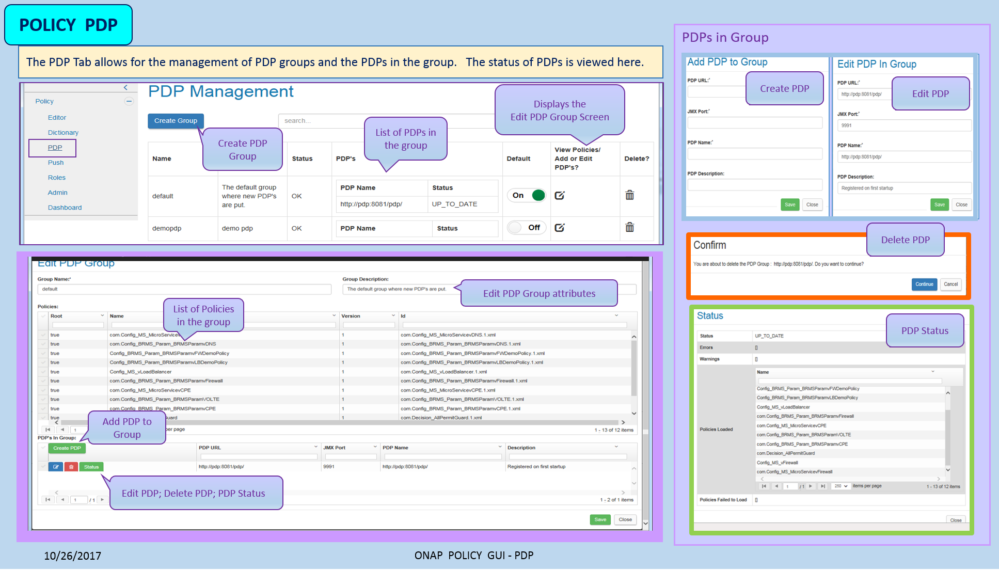
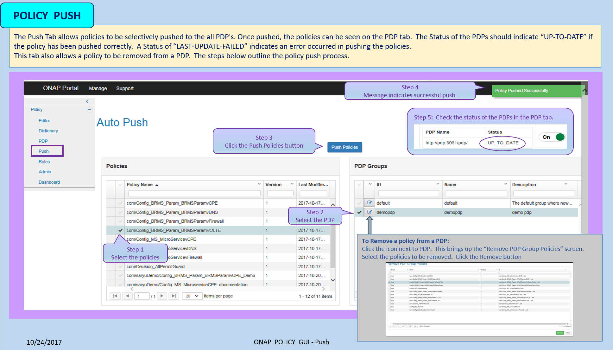
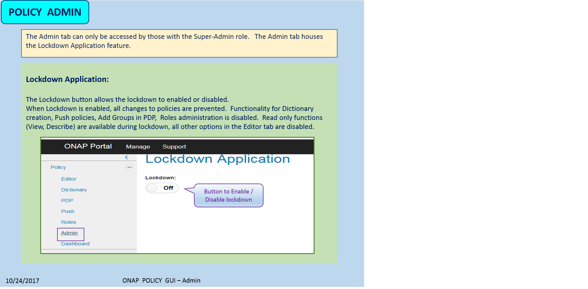
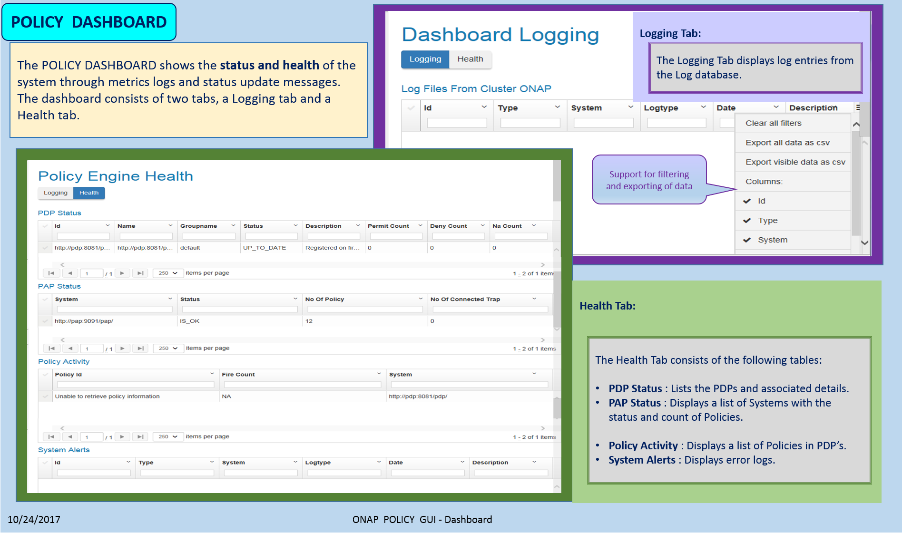

.. This work is licensed under a Creative Commons Attribution 4.0 International License.
.. http://creativecommons.org/licenses/by/4.0

**********
Policy GUI
**********

.. contents::
    :depth: 3

| The POLICY GUI is a graphical user interface, available via web-access, for **creating and managing** policies.   
|
| The targetted users are those responsible for creating and managing policies that control network operations, including policy based network configuration and auto-corrective actions.  This typically includes network and service designers, operations engineers and security experts. 
|
| The GUI consists of the **Editor, Dictionary, PDP, Push, Roles, Admin** and **Dashboard** Tabs; which provide an intuitive manner for policy rules to be created, changed, and managed.  

Access to the POLICY GUI
^^^^^^^^^^^^^^^^^^^^^^^^

The POLICY GUI can be accessed via the ONAP Portal.

.. image:: PolicyGUI_Access.png

POLICY Editor
^^^^^^^^^^^^^

The POLICY **Editor** tab supports the following **key** functionality:  

•	Create Policies and Scopes
•	Edit, View and Describe Policies
•	Rename, Move and Clone Policies
•	Switch Versions of Policies
•	Delete Policies and Scopes
•	List Policies and Scopes 
•	Export and Import Policies
•	Search for Policies 

Scope
-----

This is the POLICY Editor landing page.  Existing Scopes and their associated policies are displayed.  The diagram below show the functionality available on the screen and also how to add and manage Scopes.

|

Policy Creation
---------------

The most important function of the GUI is to facilitate the creation of policies.  
The figure below specifies how a policy can be created. 

.. image:: PolicyGUI_Editor_CreatePolicy.png

|

Managing a Policy 
-----------------

The GUI provides actions (Edit, Clone, Move, Rename, Describe, View etc) to support maintaining 
the policy after it has been created.  The figure below specifies how to initiate an action.

.. image:: PolicyGUI_Editor_PolicyActions.png

The next step of the selected action is shown below.

.. image:: PolicyGUI_Editor_PolicyActionsDetail.png

|

POLICY Dictionary
^^^^^^^^^^^^^^^^^

| The POLICY **Dictionary** tab is used to create and manage attributes in the dictionaries.  
| Each policy type has one or more dictionaries associated with it.  Policy writers have the ability to easily define and add attributes into the dictionary as shown below.  

.. image:: PolicyGUI_Dictionary.png

|

POLICY PDP
^^^^^^^^^^

| The POLICY **PDP** tab is used to manage **PDP Groups**.  
| This tab provides the capability to create, edit and delete PDP groups.  This tab also provides the ability to check status and view policies in a PDP groups.

|

POLICY Push
^^^^^^^^^^^

| The POLICY **Push** tab allows policies to be selectively pushed to the all PDPs.
| Once pushed, the policies can be seen on the PDP tab.  A Status of the PDPs indicate “UP-TO-DATE” if the policy has been pushed correctly.  A Status of “LAST-UPDATE-FAILED” indicates an error occurred in pushing the policies.

|

POLICY Roles
^^^^^^^^^^^^

| The POLICY **Roles** tab allows system administrators to assign roles for system access.  
| The GUI options vary depending on the role.  The roles for POLICY are:

•	Policy Super Admin
•	Policy Super Editor
•	Policy Super Guest
•	Policy Admin
•	Policy Editor
•	Policy Guest

POLICY Admin
^^^^^^^^^^^^

| The POLICY **Admin** tab houses functionality that is performed by an administrator.  
| Only super users have access to the Admin Tab.  The Lockdown feature is accessed from this tab.

|

POLICY Dashboard 
^^^^^^^^^^^^^^^^

| The POLICY **Dashboard** shows the **status** and **health** of the system through metrics logs and status update messages.  The dashboard consists of two tabs, a **Logging** tab and a **Health** tab. 

|

End of Document
