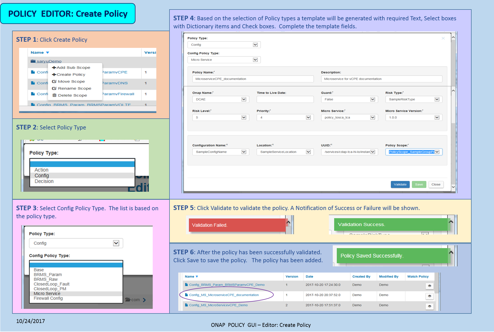

.. This work is licensed under a Creative Commons Attribution 4.0 International License.
.. http://creativecommons.org/licenses/by/4.0

**********
Policy GUI
**********

.. contents::
    :depth: 3

The POLICY GUI is a graphical user interface, available via web-access, for **creating and managing** policies.   

| The GUI consists of the **Editor, Dictionary, PDP, PUSH, Roles, Admin and Dashboard** tabs.  
|
| The typical targetted users are those who have the responsibility and authority to create and manage policies that control network operations including policy based network configuration and auto-corrective actions.  This includes network and service designers, operations engineers and security experts. The POLICY GUI provides Users to effortlessly create, change, and manage policy rules.

Access to the POLICY GUI
^^^^^^^^^^^^^^^^^^^^^^^^

The POLICY GUI can be accessed via the ONAP Portal.

POLICY Editor
^^^^^^^^^^^^^

| The POLICY EDITOR tab houses **key functionality** for the POLICY application.  
| The following functionality is supported:  

•	Create Policies and Scopes
•	Edit, View and Describe Policies
•	Rename, Move and Clone Policies
•	Switch Versions of Policies
•	Delete Policies and Scopes
•	List Policies and Scopes 
•	Export and Import Policies
•	Search for Policies 

Scope 
-----

The diagram below shows the POLICY Editor landing page. This page lists the existing Scopes and associated Policies. 
A scope must exist before a policy can be added.  The diagram outlines how to add a new scope.

.. image:: PolicyGUI_Editor_Scope.png

|

Create a Policy
---------------

The most important function of the GUI is to facilitate the creation of policies.  
The figure below specifies how a policy can be created. 

|

Policy Actions (Edit, View ...)
-------------------------------

The POLICY GUI provides actions (Edit, Clone, Move, Rename, Describe, View etc) to facilitate maintaining 
the policy after it has been created.  The figure below identifies how to intiated an action via the GUI.

|
|

|

POLICY Dictionary
^^^^^^^^^^^^^^^^^

| The POLICY DICTIONARY tab is used to create and manage attributes in the dictionaries.  
| Each policy type has one or more dictionaries associated with it.  The dictionaries should contain all attributes that may be referenced by the policies.  Policy writers have the ability to easily define attributes and add them into the dictionary via the POLICY GUI as shown below.  

|

POLICY PDP
^^^^^^^^^^

| The POLICY PDP tab is used to managing **PDP Groups**.  
| This tab provides the capability to create, edit and delete PDP groups.  This tab also provides the ability to check status and view policies in a PDP groups.

POLICY Push
^^^^^^^^^^^

| The POLICY PUSH tab allows policies to be selectively pushed to the all PDPs.
| Once pushed, the policies can be seen on the PDP tab.  A Status of the PDPs indicate “UP-TO-DATE” if the policy has been pushed correctly.  A Status of “LAST-UPDATE-FAILED” indicates an error occurred in pushing the policies.

POLICY Roles
^^^^^^^^^^^^

| The POLICY ROLES tab allows system administrators to assign roles for system access.  
| The GUI options vary depending on the role.  The roles for POLICY are:

•	Policy Super Admin
•	Policy Super Editor
•	Policy Super Guest
•	Policy Admin
•	Policy Editor
•	Policy Guest

POLICY Admin
^^^^^^^^^^^^

| The POLICY ADMIN tab houses functionality that is performed by an administrator.  
| Only super users have access to the Admin Tab.  The Lockdown feature is accessed from this tab.

.. image:: PolicyGUI_Admin.png

|

POLICY Dashboard 
^^^^^^^^^^^^^^^^

| The POLICY DASHBOARD shows the status and health of the system through metrics logs and status update messages.  The dashboard consists of two tabs, a Logging tab and a Health tab. 
| 
| The **Logging Tab** displays log entries from the Log database.  This tab also supports filtering and exporting of data.
|
| The **Health Tab** includes:
|     • PDP Status :  The PDP table shows list of PDP's and the details of them.
|     • PAP Status :  The PAP table  shows list of Systems and there status and count of Policies.
|     • Policy Activity : The Policy Activity Shows the list of Policies in PDP's.
|     • System Alerts : The System Alerts table shows the logs on filtering logtype with Error.

End of Document
