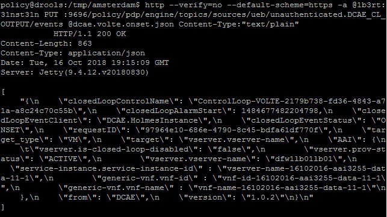
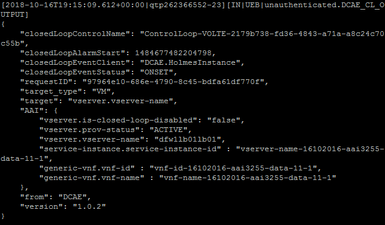

.. This work is licensed under a Creative Commons Attribution 4.0 International License.
.. http://creativecommons.org/licenses/by/4.0

**********************************************************
Tutorial: Testing the VOLTE Use Case in a standalone PDP-D 
**********************************************************

.. contents::
    :depth: 3

In this tutorial we will go over how to access and start up the PDP-D, setup the prerequisites for the VOLTE flow, enable/disable the VFC Simulator that will be used in the VOLTE flow, and inject messages to trigger the VOLTE flow.

Accessing and starting the PDP-D
^^^^^^^^^^^^^^^^^^^^^^^^^^^^^^^^ 

The first step is to access the docker container of name *drools*.

    .. code-block:: bash

        docker exec -it -u 0 drools su - policy

The PDP-D software is installed under the *policy* account, the policy root directory is under *${POLICY_HOME}* environment variable and it may be changed on a per installation basis.   It is typically set up under the */opt/app/policy* directory but can be changed during installation.   All PDP-D software runs with non-root privileges as *policy* is a regular user account.

Once within the drools container, the running status can be observed by using the *policy* command:

    .. code-block:: bash
    
        policy [--debug] status|start|stop
    
The running status of the PDP-D can be observed with *policy status*

    .. code-block:: bash
    
        policy@drools:~$ policy status [drools-pdp-controllers]  L []: Policy Management (pid 1500) is running  1 cron jobs installed.
    

Prerequisites for the VOLTE flow
^^^^^^^^^^^^^^^^^^^^^^^^^^^^^^^^ 

In order to trigger the VOLTE flow we will need to inject an ONSET message via curl command. We're going to create a temporary *util* directory to store a file that contains the VOLTE ONSET message.

Navigate to */tmp* and create directory *util*.  *util* is just a temporary folder we've created to use as our 'workspace'.

    .. code-block:: bash
    
        cd /tmp
        mkdir util

Next, we're going to create a file named *dcae.volte.onset.json* and edit it to paste the VOLTE ONSET message contents.

    .. code-block:: bash
    
        touch dcae.volte.onset.json
        vi dcae.volte.onset.json

Here are the contents of the VOLTE ONSET message. Copy/paste this into dcae.volte.onset.json:

    .. code-block:: json

        {
            "closedLoopControlName": "ControlLoop-VOLTE-2179b738-fd36-4843-a71a-a8c24c70c55b",
            "closedLoopAlarmStart": 1484677482204798,
            "closedLoopEventClient": "DCAE.HolmesInstance",
            "closedLoopEventStatus": "ONSET",
            "requestID": "97964e10-686e-4790-8c45-bdfa61df770f",
            "target_type": "VM",
            "target": "vserver.vserver-name",
            "AAI": {
                "vserver.is-closed-loop-disabled": "false",
                "vserver.prov-status": "ACTIVE",
                "vserver.vserver-name": "dfw1lb01lb01",
                "service-instance.service-instance-id" : "vserver-name-16102016-aai3255-data-11-1",
                "generic-vnf.vnf-id" : "vnf-id-16102016-aai3255-data-11-1",
                "generic-vnf.vnf-name" : "vnf-name-16102016-aai3255-data-11-1"
            },
            "from": "DCAE",
            "version": "1.0.2"
        }
        

Enabling the VFC Simulator
^^^^^^^^^^^^^^^^^^^^^^^^^^ 

Enabling the *controlloop-utils* feature will enable the simulators. To do this, simply stop the drools pdp, enable the feature, and restart the drools pdp like so: 

    .. code-block:: bash
    
        policy stop
        features enable controlloop-utils
        policy start

Now, in */opt/app/policy/config/* directory, you should see a new properties file named *simulators.properties.environment*. In here you will find the credentials for the VFC simulator.

Injecting an ONSET to trigger the VOLTE Flow
^^^^^^^^^^^^^^^^^^^^^^^^^^^^^^^^^^^^^^^^^^^^ 

We are now ready to inject an ONSET message to trigger the VOLTE flow. Simply navigate back to the directory *dcae.volte.onset.json* file is saved (i.e. cd /tmp/util) and run this curl command:

    .. code-block:: bash
    
        http --verify=no --default-scheme=https -a @1b3rt:31nst31n PUT :9696/policy/pdp/engine/topics/sources/ueb/unauthenticated.DCAE_CL_OUTPUT/events @dcae.volte.onset.json Content-Type:"text/plain"

You should see some output similar to this:

You can view the logs to see the network activity or find any errors that may have occurred. Logs are located in */opt/app/policy/logs*.

Reading the logs
^^^^^^^^^^^^^^^^

Once you've injected the onset message, this should appear in the network.log:

End of Document

.. SSNote: Wiki page ref. https://wiki.onap.org/display/DW/Tutorial%3A+Testing+the+VOLTE+Use+Case+in+a+standalone+PDP-D
